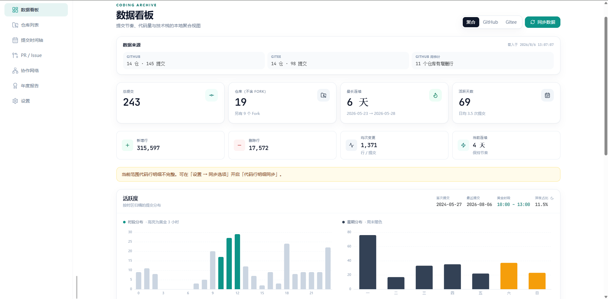
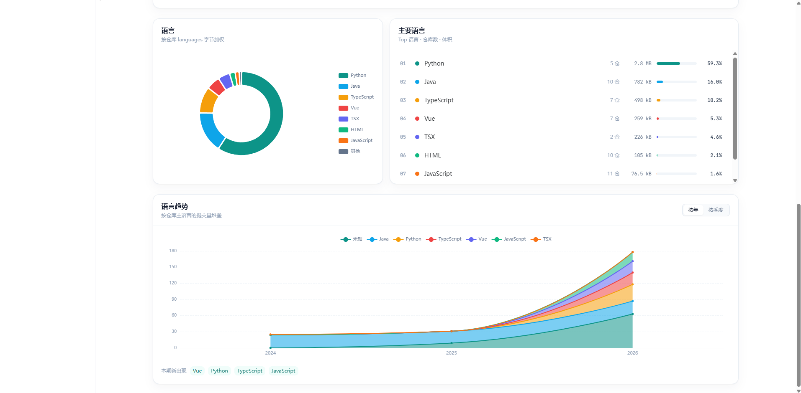
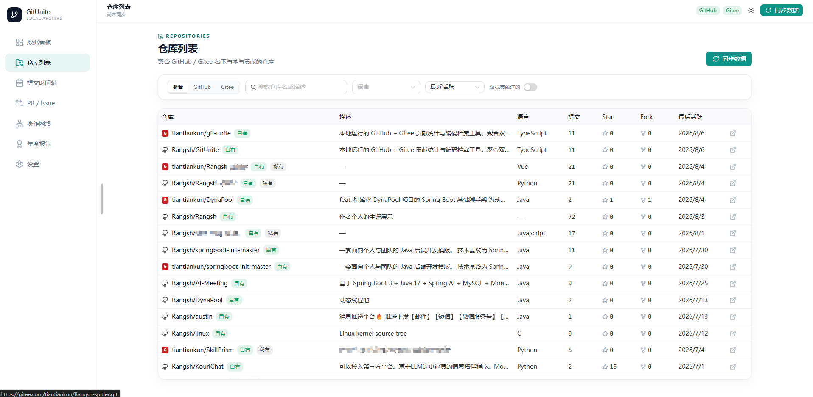
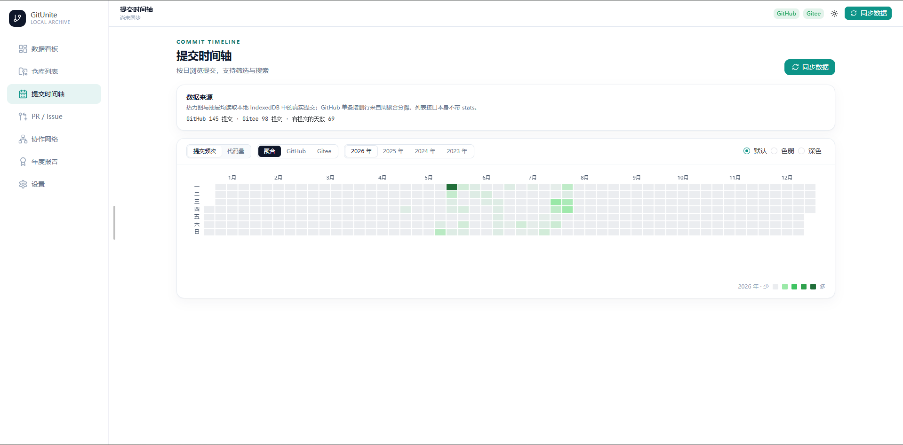
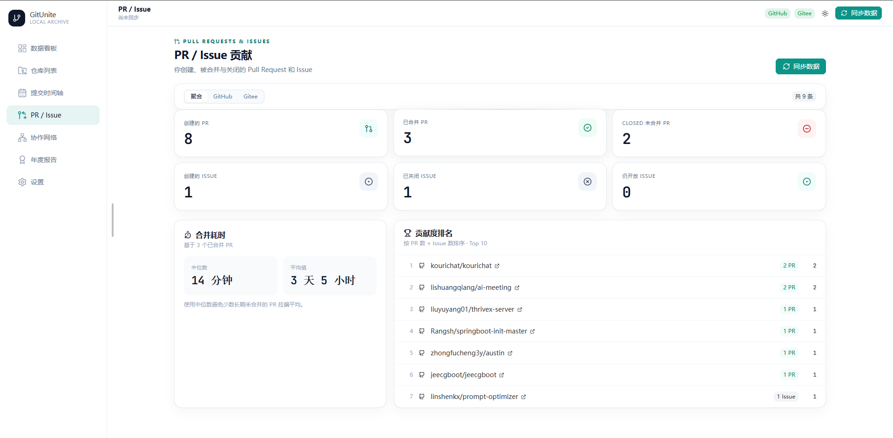
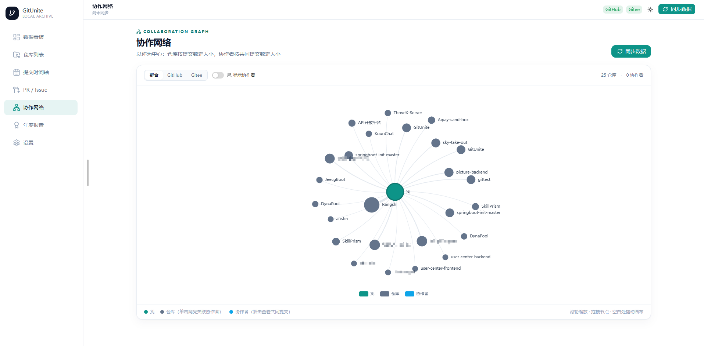
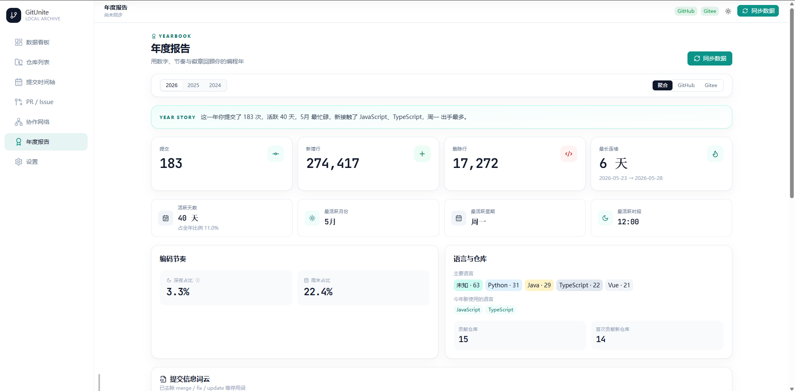
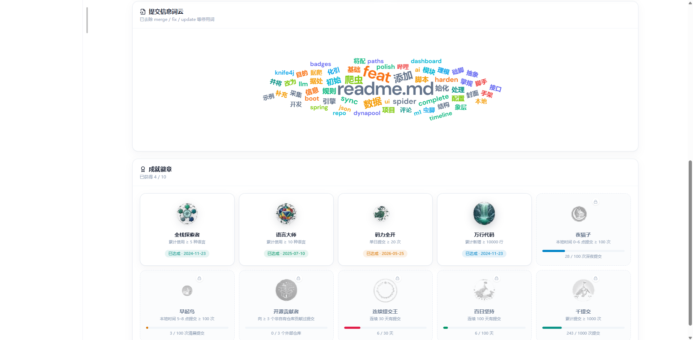
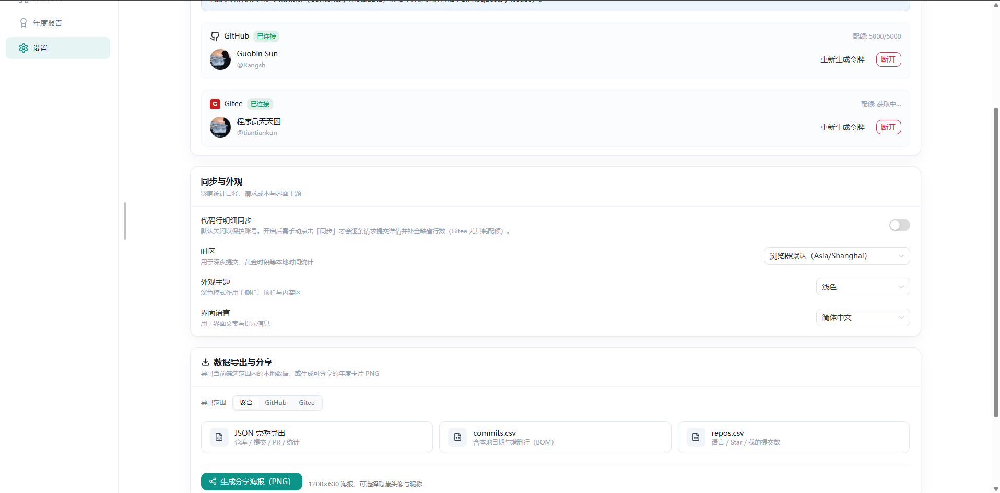

<p align="center">
  
</p>

<h1 align="center">GitUnite</h1>

<p align="center">
  <strong>本地优先</strong>的 GitHub / Gitee 个人编码档案<br />
  无后端 · 数据不出浏览器 · 双平台聚合分析
</p>

<p align="center">
  <a href="./LICENSE"></a>
  <a href="https://vuejs.org/"></a>
  <a href="https://vitejs.dev/"></a>
  <a href="https://www.typescriptlang.org/"></a>
  
</p>

<p align="center">
  <a href="#特性">特性</a> ·
  <a href="#界面预览">界面预览</a> ·
  <a href="#快速开始">快速开始</a> ·
  <a href="#token-权限">Token</a> ·
  <a href="#参与贡献">贡献</a> ·
  <a href="#开源协议">协议</a>
</p>

<p align="center">
  
</p>

---

## 特性

| | |
| --- | --- |
| 🔒 **隐私优先** | Token 与业务数据仅存本机（`localStorage` + IndexedDB），无服务端、不上报 |
| 🐙 **双平台** | GitHub + Gitee，支持单平台 / 聚合视角切换 |
| 📊 **数据看板** | 提交、代码量、活跃时段、语言分布、贡献热力图 |
| 📅 **提交时间轴** | 按日浏览，支持 message 搜索与 Merge 过滤 |
| 🔀 **PR / Issue** | 创建 / 合并 / 关闭统计、合并耗时、贡献仓库 Top 10 |
| 🏅 **年度报告** | 年鉴故事、词云、本地成就徽章 |
| 💾 **导出分享** | JSON / CSV（UTF-8 BOM）、1200×630 分享海报 PNG |
| 🌐 **体验** | 简体中文 / English；浅色 / 深色 / 跟随系统 |

同步**仅由你手动点击触发**，打开应用不会自动请求接口。

---

## 界面预览

### 数据看板



### 语言统计



### 仓库列表



### 提交时间轴



### PR / Issue



### 协作网络



### 年度报告



### 成就与词云



### 设置



---

## 快速开始

**环境要求：** Node.js 18+、[pnpm](https://pnpm.io/)

```bash
git clone https://github.com/Rangsh/GitUnite.git
cd GitUnite
pnpm install
pnpm dev
```

浏览器打开 [http://localhost:5173](http://localhost:5173)，进入「设置」粘贴 GitHub / Gitee 的 Personal Access Token，再点击「同步数据」。

### 常用命令

| 命令 | 说明 |
| --- | --- |
| `pnpm dev` | 本地开发 |
| `pnpm build` | 类型检查 + 生产构建 |
| `pnpm preview` | 预览构建产物 |
| `pnpm typecheck` | 仅 TypeScript 检查 |
| `pnpm lint` | ESLint |
| `pnpm test` | Vitest |

---

## Token 权限

请使用**只读**权限，按需勾选：

| 平台 | 最低权限 | 需要 PR / Issue 时追加 |
| --- | --- | --- |
| **GitHub** Fine-grained | Contents、Metadata | Pull requests、Issues |
| **Gitee** 私人令牌 | `projects`、`user_info` | `pull_requests`、`issues` |

> 请勿在不可信设备或装有不可信浏览器扩展的环境中粘贴 Token。

---

## 技术栈

- **框架：** Vue 3、TypeScript、Vite
- **状态 / 路由 / i18n：** Pinia、Vue Router、vue-i18n、VueUse
- **UI：** Naive UI、Tailwind CSS、lucide-vue-next
- **图表：** ECharts、vue-echarts、echarts-wordcloud
- **本地数据：** Dexie（IndexedDB）
- **其它：** axios、dayjs、Papa Parse、html-to-image

产品范围见 [产品需求文档](./docs/产品需求文档.md)。

---

## 仓库镜像

- GitHub：https://github.com/Rangsh/GitUnite
- Gitee：https://gitee.com/tiantiankun/git-unite

---

## 参与贡献

欢迎 Issue 与 Pull Request。请先阅读 [贡献指南](./CONTRIBUTING.md)。

---

## 开源协议

本项目基于 [MIT](./LICENSE) 协议开源。

Copyright © 2026 Rangsh
